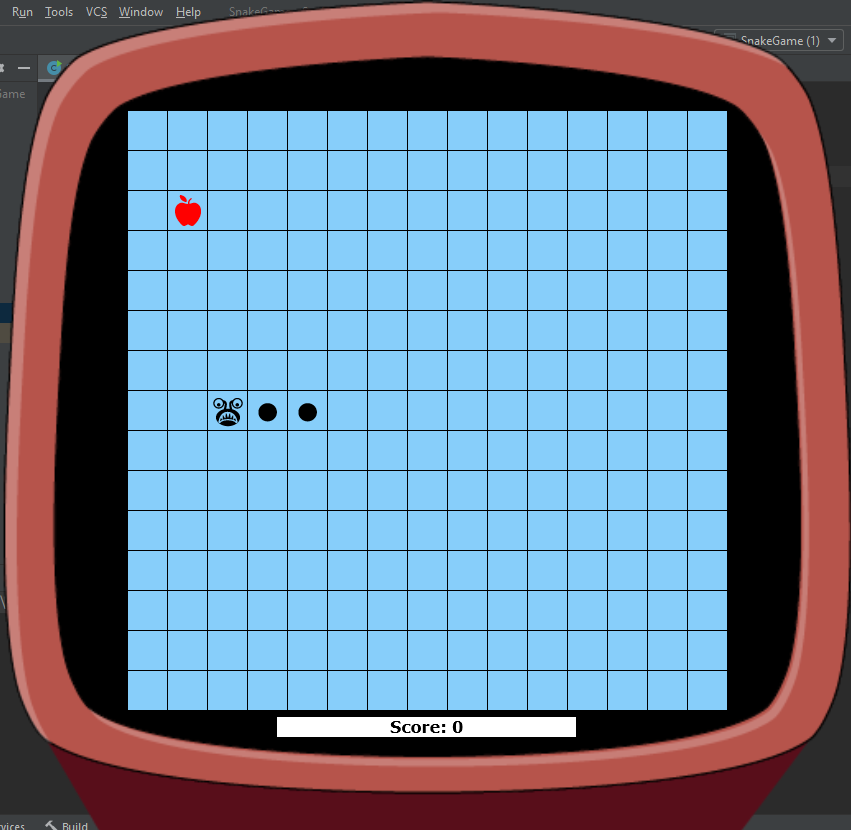
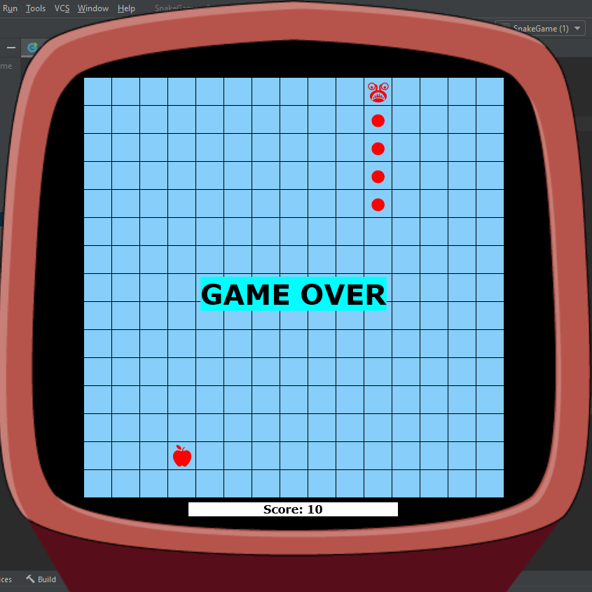

## Игра змейка
Классическая игра "Змейка".  
Змейка двигается по полю и ,собирая артефакт (яблоко), увеличивает очки на табло и увеличивается в теле. 
 
  

При попадании в края игрового поля или в своё тело - Конец игры.  

  
